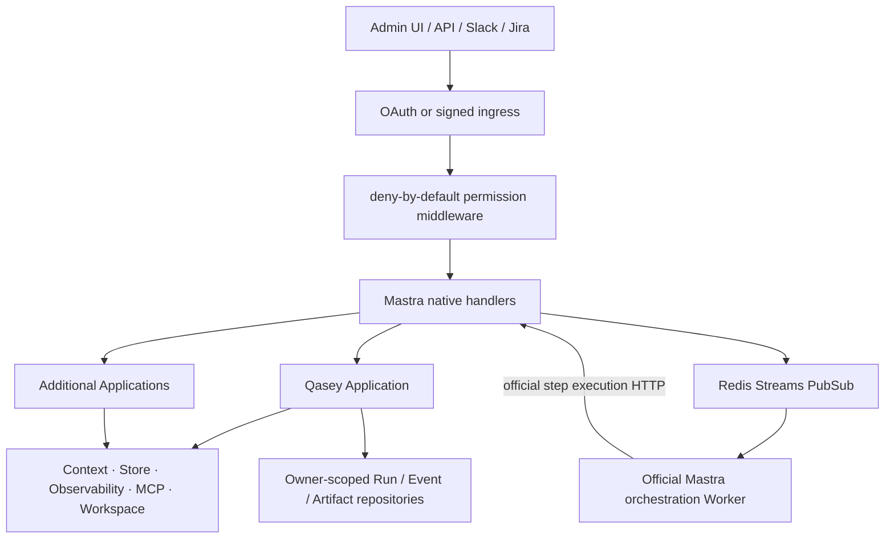

# Shared Mastra Runtime Architecture

## Runtime boundary

`src/mastra/index.ts` is the official Mastra entry point and contains the only production `new Mastra(...)`. `src/runtime/create-runtime.ts` only flattens and validates Application bundles into Mastra configuration; the bundles are ownership/DI metadata, not execution primitives.

Application bundles catalog both code-registered and file-discovered Agent IDs so authorization is complete before the server starts. Only code-registered Agents enter `MastraConfig.agents`; `mastra dev` and `mastra build` own the single runtime registration of file-discovered Agents.

Registry keys and primitive canonical IDs are identical and prefixed with `${applicationId}-`. Every registered primitive and custom route has permission metadata. Unknown server routes are rejected. Internal primitives, such as the intent router, are held by application services and are not registered. A lifecycle-dependent internal workflow may be registered with a service-only audience.

## Trust and ownership

OAuth and service identities are converted to a server-owned principal. The middleware derives application, tenant, roles, memory resource/thread, request ID, and ingress source. Request body/header ownership values are not copied.

- Private resource: `application:tenant:user`
- Shared resource: `application:tenant:conversation`
- Thread: `application:tenant:kind:external-thread`
- Domain owner: `{ applicationId, tenantId }`
- External write key: `application:tenant:workflow:run:effect`

Runs, events, artifacts, channel delivery IDs, permissions, and OAuth credentials all include owner information in their storage key or primary key.

## Native capabilities

- Agent/Workflow execution uses Mastra server endpoints.
- Production uses Mastra's official fully split orchestration Worker: the API sets `MASTRA_WORKERS=false`, the private worker sets `MASTRA_WORKERS=orchestration`, and `MASTRA_STEP_EXECUTION_URL` delegates step execution back to the API.
- API and Worker artifacts are produced only by `mastra build` and `mastra worker build`. There is no Qasey worker entry point, queue protocol, poll loop, lease, or direct workflow executor.
- Slack uses Mastra Channels with signed webhook or Socket Mode, native streaming, approvals, attachments, dedupe, and per-thread queueing.
- Long-running state uses Workflow snapshots and Redis Streams event delivery. The removed generic queue worker is not a durability layer.
- Mastra domains use `MastraCompositeStore`; Qasey domain data remains in explicit repositories.
- Workspace is dynamic per application/tenant/task/execution/role. Production exposes no execution sandbox unless a remote provider is configured.
- Non-OAuth MCP service connections are shared. OAuth connections use a bounded subject pool and separate encrypted credential namespace.

## Process lifecycle

The composition root owns stores, repositories, MCP clients, sandbox cache, permission store, and audit store. `closeRuntime()` closes them in reverse ownership order. Production has an API Deployment and an official orchestration Worker Deployment built from the same source entry point. Only the API exposes HTTP; the Worker pulls Redis events and calls the API over the cluster network. There is no separate Slack receiver or generic Qasey worker.

## Intentional product-layer extensions

Two extensions are explicit architecture boundaries, not alternate Mastra runtimes:

- Google OAuth/OIDC, encrypted browser sessions, service Bearer tokens, tenant permissions, and audit decisions are platform-owned. The runtime does not configure Mastra Enterprise auth; the same deny-by-default middleware authenticates and authorizes Admin UI, API, Worker, and channel requests before native handlers execute.
- `/admin` is the multi-Application product console needed for Qasey and future Agents. Mastra Studio remains the developer/debugging surface; Admin UI uses the registered Application catalog and business-safe routes.

## Observability

Mastra Observability and the storage exporter are authoritative. Datadog receives application, tenant, user, request, thread, task, channel, agent/workflow/model fields when available. Credentials, email, prompts, bodies, attachments, and long content are redacted by default. Authorization decisions and permission mutations are written to the audit log.
