# Qasey Agent 代码化与 E2E 左移实施计划

> 状态：M1/M2 + Web/App E2E vertical-slice implemented（组织环境接入与生产 runner pool 待配置）  
> 日期：2026-08-13  
> 目标：先将现有 n8n Qasey workflow 迁移为可部署、可观测、可测试的代码 Agent；随后扩展为从测试用例生成 E2E 代码、执行验证、展示证据并创建 Draft PR 的 QA Agent 平台。

## 1. 已确认的技术决策

| 领域 | 决策 |
|---|---|
| 主语言 | TypeScript |
| Agent / Workflow 控制面 | Mastra |
| Trigger 层 | 自有 Trigger Gateway；平台协议由官方 SDK/Receiver 处理，内部统一事件、去重、路由和回复目标由我们维护 |
| Coding Harness | 通过统一接口接入；首个实现优先 Claude Agent SDK，保留 DeepAgents / OpenAI Agents Adapter |
| 代码编写环境 | 独立 Code Authoring Workspace；每个任务获得隔离、可写、可执行命令的临时工作区，由 Workspace Manager 管理生命周期 |
| Web E2E | Playwright，产物为标准 TypeScript 测试代码 |
| App E2E | Maestro，产物为标准 YAML Flow |
| Computer Use | Cua，仅用于探索、系统 UI、跨应用和定位失败兜底 |
| 运行平台 | Kubernetes；长任务由 Worker / Job 执行，不挂在 Webhook 请求中 |
| 流程状态 | PostgreSQL 持久化；队列负责异步调度 |
| 运行证据 | 对象存储保存 report、trace、video、screenshots 和 logs |
| GitHub 写操作 | 独立 GitHub App Broker；Agent 和执行沙箱不持有长期写权限 |
| PR 策略 | Clean-room verifier 通过后创建 Draft PR；QA 验收后再转 Ready，不自动合并 |

## 2. 目标与边界

### 2.1 第一阶段：代码化迁移

迁移现有 Qasey workflow 的能力，包括：

- Webhook、Chat 和 Slack 入口。
- Slack thread 上下文、reaction 和回复。
- Jira、GitHub、Lark、Figma、Slack、RAG、QA Experience 等信息源。
- 基于测试维度清单的需求分析和用例生成。
- MeterSphere 模块查询、模块创建和测试用例写入。
- Postgres 会话状态、失败处理、审计和可观测性。

迁移不是把 n8n 节点逐个翻译成代码。目标是把系统拆成清晰的确定性步骤：

1. 收集上下文。
2. Agent 生成结构化分析和测试用例。
3. Controller 校验输出。
4. Controller 执行 MeterSphere、Slack 等外部写操作。
5. 记录结果与证据。

### 2.2 第二阶段：E2E 左移

在结构化测试用例生成后，继续完成：

1. 判断目标平台为 Web、iOS 或 Android。
2. Web 生成 Playwright TypeScript；App 生成 Maestro YAML。
3. 在隔离 Author 环境中运行和有界修复。
4. 在全新 Verifier 环境中独立复跑。
5. 汇总实际运行证据供 QA 查看。
6. 验证通过后创建 Draft PR。
7. QA 根据真实运行效果决定通过或反馈修改。

### 2.3 明确不做

- 不把 Cua 作为 Web/App 正常测试执行器。
- 不让模型自行声明测试通过；pass/fail 来自 Runner、断言和退出码。
- 不在断言失败后调用 Cua 绕过产品问题。
- 不让 Coding Agent 直接创建 PR、合并 PR 或持有 GitHub App 私钥。
- 不在第一阶段同时建设完整设备云和跨 OS 矩阵。
- 不追求把所有 n8n 实现细节原样保留；保留的是外部行为、数据契约和业务规则。
- 不在迁移验收完成前下线 n8n；n8n 保留为回滚路径。

## 3. 总体架构

```mermaid
flowchart LR
    Slack["Slack Events"] --> SlackAdapter["Slack Bolt Adapter"]
    Http["HTTP API / QA UI"] --> HttpAdapter["HTTP Adapter"]
    Future["Jira / GitHub / CI / MeterSphere"] --> FutureAdapters["Official Webhook Adapters"]
    SlackAdapter --> Trigger["Trigger Gateway"]
    HttpAdapter --> Trigger
    FutureAdapters --> Trigger
    Trigger --> Inbox["Durable Trigger Inbox"]
    Inbox --> Queue["Queue"]
    Queue --> Mastra["Mastra Orchestrator"]

    Mastra --> Context["Context Connectors"]
    Context --> Sources["Jira / GitHub / Lark / Figma / Slack / RAG"]

    Mastra --> Analysis["QA Analysis Agent"]
    Analysis --> MS["MeterSphere Controller"]

    Mastra --> Router{"E2E Target"}
    Router -->|Web| PW["Playwright Adapter"]
    Router -->|App| Maestro["Maestro Adapter"]

    Mastra --> Workspace["Workspace Manager"]
    PW --> Workspace
    Maestro --> Workspace
    Workspace --> Author["Code Authoring Workspace"]
    Author -. "仅允许的兜底条件" .-> Cua["Cua Explorer"]
    Author --> Verify["Clean-room Verifier Job"]
    Verify --> Evidence["Evidence Store"]
    Evidence --> Review["QA Review"]
    Review --> Broker["GitHub App PR Broker"]
    Broker --> Draft["Draft PR"]
```



### 3.1 控制面与执行面分离

**控制面负责：**

- 工作流状态、重试、超时、HITL 和审计。
- 选择 Agent、Runner 和运行环境。
- 校验结构化输出。
- 触发确定性外部写操作。
- 聚合运行证据和生成 QA Review 数据。

**执行面负责：**

- Checkout 仓库和准备依赖。
- 读取、修改和构建代码。
- 启动 Web/App 被测环境。
- 执行 Playwright 或 Maestro。
- 上传测试报告和调试证据。

## 4. 核心组件

### 4.1 Trigger Gateway

Trigger Gateway 是外部事件与 Mastra workflow 之间的稳定边界：

```text
Official Receiver → Trigger Adapter → Trigger Gateway → Durable Inbox/Queue → Mastra
```

#### 自研与复用边界

**不自行实现：**

- Slack、GitHub、Jira 等平台的签名算法、OAuth 和 payload parsing。
- Slack Events API、interaction、slash command 的 ACK 机制。
- 各平台 API client、rate-limit 基础行为和标准错误类型。

这些能力优先使用平台官方 SDK。Slack 使用 `@slack/bolt`；生产环境使用 HTTP Events API，Socket Mode 只用于本地开发。

**由 Qasey 自行维护：**

- 统一 `TriggerEnvelope` 和版本演进。
- 基于外部 event ID 的幂等和去重。
- 用户、tenant、repo、测试环境和权限上下文解析。
- Trigger intent 识别与 Mastra workflow 路由。
- conversation/session key 和 `replyTo` 解析。
- 原始 payload 的安全存储引用、审计和 trace context。
- Durable inbox：接受成功后再快速 ACK，业务处理完全异步。

Trigger handler 禁止直接运行 Agent。以 Slack 为例，入口只完成签名验证、转换、持久化、入队和快速 ACK；Slack 回复、reaction、MeterSphere 写入等由后续 workflow/outbox 执行。

#### 统一 Trigger 契约

```ts
type TriggerSource =
  | "slack"
  | "api"
  | "web"
  | "jira"
  | "github"
  | "metersphere"
  | "ci"
  | "schedule";

type TriggerIntent =
  | "analyze_requirement"
  | "generate_test_cases"
  | "generate_e2e"
  | "rerun_e2e"
  | "submit_review_feedback"
  | "approve_pr_ready"
  | "cancel_run";

interface TriggerEnvelope {
  schemaVersion: "1";
  eventId: string;
  idempotencyKey: string;
  source: TriggerSource;
  eventType: string;
  intent: TriggerIntent;
  occurredAt: string;
  actor: {
    externalId: string;
    tenantId?: string;
  };
  subject: {
    type: "requirement" | "pull_request" | "test_case" | "run";
    externalId?: string;
    url?: string;
  };
  conversation?: {
    key: string;
  };
  replyTo?: {
    channel: "slack" | "web" | "github" | "jira";
    target: Record<string, string>;
  };
  rawPayloadRef: string;
  traceId: string;
}
```

原始 payload 不作为领域模型在各组件间传播；它经过加密/脱敏后保存，由 `rawPayloadRef` 引用。

#### Slack 兼容策略

当前 n8n 的 Slack 入口只订阅 `app_mention`。代码版必须首先保持：

- 相同 Slack App 和 `app_mention` 行为。
- 相同 thread 归属：`thread_ts ?? ts`。
- 相同用户、channel、team 上下文。
- reaction 进度状态和 thread 内最终回复。
- Slack 重试不会导致重复执行或重复回复。

映射约定：

```ts
eventId = body.event_id;
idempotencyKey = `slack:${body.event_id}`;
conversation.key = `slack:${teamId}:${channelId}:${threadTs ?? messageTs}`;
replyTo.target = {
  channelId,
  threadTs: threadTs ?? messageTs,
};
```

Slack DM 需要额外订阅 `message.im`，不属于首轮等价性验收；在 `app_mention` 稳定后作为新增能力接入。

Mastra Channels 可用于简单聊天 PoC 或未来轻量 QA Chat，但不作为核心 Trigger Gateway。Qasey 的流程包含长任务、外部写入、E2E Job、HITL 和延迟回复，需要显式 durable inbox、幂等与 outbox 边界。

#### 回复与 Trigger 分离

所有异步回复进入 Notification Outbox：

```ts
interface OutboundMessage {
  idempotencyKey: string;
  channel: "slack" | "web" | "github" | "jira";
  target: Record<string, string>;
  messageType: "progress" | "result" | "error" | "approval";
  content: unknown;
}
```

渠道发送失败只重试消息投递，不重跑需求分析、MeterSphere 写入或 E2E 生成。

#### Trigger 支持路线

| 优先级 | Trigger | 触发条件 | Intent |
|---|---|---|---|
| P0 | Slack `app_mention` | 兼容当前入口 | `analyze_requirement` / `generate_test_cases` |
| P0 | HTTP `POST /v1/runs` | API 调用显式指定 | 按请求指定 |
| P0 | QA Web 手动提交 | QA 从 Review/UI 发起 | `analyze_requirement` |
| P0 | QA feedback / cancel / rerun | 已存在 run 上的明确操作 | `submit_review_feedback` / `cancel_run` / `rerun_e2e` |
| P1 | Slack `message.im` / interactive action | DM 或消息按钮 | 分析、生成 E2E、重跑、停止 |
| P1 | Jira issue/comment | label `qasey` 或 `/qasey analyze` | `analyze_requirement` |
| P1 | GitHub PR comment/label | `/qasey analyze`、`/qasey e2e` 或约定 label | 分析或 `generate_e2e` |
| P1 | MeterSphere | QA 选择 Case 并点击“生成自动化” | `generate_e2e` |
| P2 | GitHub PR `synchronize` | 仅已加入 Qasey 的 PR | 重新生成/验证 |
| P2 | PR `ready_for_review` | 已配置项目 | clean verification |
| P2 | CI / deployment event | 指定 workflow、环境或 agent-owned PR | 分析失败、运行/重跑 E2E |
| P2 | Schedule | nightly 或回归计划 | 回归、flaky 检测 |
| P3 | Lark bot、内部 Event Bus、Release Train | 按实际业务需求 | 映射到已有 intent |

Jira、GitHub 和 CI 默认采用显式 command/label opt-in，不对每次编辑或 push 无条件运行，避免噪音和成本失控。

#### n8n 到 Trigger Gateway 的迁移

```text
阶段 A：Slack → n8n → 转发 TriggerEnvelope → 新系统 Shadow（禁止外部写入）
阶段 B：Slack → n8n → 按用户/频道 Canary 到新系统
阶段 C：Slack → Bolt Trigger Gateway → 新系统；n8n 保留短期回滚
阶段 D：关闭 n8n Slack Trigger
```

在同一 Slack App 切换正式 Request URL 前，使用独立开发 Slack App 验证 Bolt；正式切换需保留旧 URL、配置快照和回滚步骤。

### 4.2 Mastra Orchestrator

- 承载当前 QA 分析 workflow 和未来 E2E workflow。
- 在有副作用的步骤前后持久化 checkpoint。
- 管理人工等待点，例如 QA 反馈、PR Ready 审批。
- 负责流程，不直接管理浏览器、模拟器和 VM 生命周期细节。

### 4.3 QA Analysis Agent

- 收集需求证据并输出业务语言分析。
- 按维度清单识别遗漏、风险和回归范围。
- 输出经过 schema 校验的 `AnalysisResult` 和 `TestCaseSpec[]`。
- 不直接写 MeterSphere；写入由 Controller 完成，从而支持幂等、重试和审计。

### 4.4 Coding Harness

业务代码只依赖统一接口：

```ts
interface CodingHarness {
  start(input: CodingTask, workspace: WorkspaceRef): Promise<RunRef>;
  stream(run: RunRef): AsyncIterable<AgentEvent>;
  resume(run: RunRef, input: HumanOrToolResult): Promise<void>;
  cancel(run: RunRef): Promise<void>;
  getResult(run: RunRef): Promise<CodingResult>;
}
```

首个实现优先使用 Claude Agent SDK，以缩短代码理解、编辑、命令执行和修复闭环的开发路径。不得把 Claude 专有 session、message 或 tool 类型泄漏到领域模型中。

### 4.5 Code Authoring Workspace

Code Authoring Workspace 是 Agent 真正读取仓库、修改文件和运行命令的环境。它与 Coding Harness、Runner 的职责不同：

| 组件 | 职责 |
|---|---|
| Coding Harness | Agent loop、上下文管理、工具调用和修复决策 |
| Workspace Manager | 创建/恢复/销毁隔离工作区，管理文件、命令、资源、网络和快照 |
| Runner Adapter | 以确定性命令执行 Playwright/Maestro，解析结果并收集证据 |

Workspace Manager 暴露稳定接口：

```ts
interface WorkspaceManager {
  create(input: CreateWorkspaceInput): Promise<WorkspaceRef>;
  exec(ref: WorkspaceRef, command: CommandSpec): Promise<CommandResult>;
  snapshot(ref: WorkspaceRef): Promise<WorkspaceSnapshotRef>;
  collectPatch(ref: WorkspaceRef): Promise<GeneratedChange>;
  destroy(ref: WorkspaceRef): Promise<void>;
}

interface CreateWorkspaceInput {
  repo: string;
  baseSha: string;
  target: "web" | "ios" | "android";
  image: string;
  resourceClass: string;
  ttlSeconds: number;
  allowedEgress: string[];
}

interface WorkspaceRef {
  id: string;
  baseSha: string;
  filesystemRef: string;
  runtimeRef: string;
  expiresAt: string;
}
```

#### Workspace 生命周期

```text
ALLOCATE
  → CHECKOUT_BASE_SHA
  → HYDRATE_DEPENDENCIES
  → AUTHOR
  → RUN_AND_REPAIR
  → COLLECT_PATCH_AND_ARTIFACTS
  → SNAPSHOT_IF_NEEDED
  → DESTROY
```

最低能力要求：

- Checkout 指定 repo 和固定 `baseSha`，避免执行期间基线漂移。
- 提供隔离、可写的 repo filesystem 和受控 shell/PTY。
- 支持 Git diff、TypeScript/LSP、依赖安装、build、lint 和测试命令。
- 固定运行镜像和工具版本；记录 image digest。
- 流式输出 command/agent events，支持超时、取消和资源上限。
- 将 patch、agent transcript、command logs 和测试证据上传到持久存储。
- 支持在 Pod 丢失或等待 QA 时从 snapshot/patch 恢复，而不是依赖本地临时目录。
- Agent 只在本地 worktree 产生 commit/patch，不持有 PR 创建权限。

#### Web 与 App 的运行差异

- **Web：** Author Workspace 可以直接包含 Node.js、pnpm、Playwright browsers，并在同一 Job 中完成编写、启动服务和首轮运行。
- **Android：** 普通 Author Workspace 负责生成 Maestro YAML；需要设备验证时，由 Android Runner 调度到带 KVM 的专用节点。无需让每个代码编辑 Pod 都常驻 emulator。
- **iOS：** Author Workspace 可在 Linux 上生成 YAML，但执行必须提交到独立 macOS runner pool。
- **Cua：** 不作为默认 Workspace；只有满足兜底策略时，Workspace/Runner 将探索任务委派给独立 Cua sandbox。

#### 初始实现与演进

第一版直接以 Kubernetes Job 实现 Workspace：

```text
K8s Job
├── init container：checkout 固定 SHA、准备 workspace
├── author worker：Coding Harness + shell + repo tools
├── workspace volume：临时文件系统
└── artifact uploader：上传 patch/log/report 后清理
```

短任务可使用 `emptyDir`；需要跨 Pod 恢复、长时间等待或大依赖缓存时使用受限 PVC，并始终把 patch/checkpoint 同步到持久存储。禁止挂载宿主机 Docker socket。

后续可以把实现封装成 Mastra Workspace/Sandbox provider，或接入外部 sandbox provider，但领域层始终只依赖 `WorkspaceManager`，不绑定特定供应商。

### 4.6 Runner Adapters

```ts
interface E2ERunnerAdapter {
  framework: "playwright" | "maestro";
  inspectRepository(workspace: WorkspaceRef): Promise<RepositoryConventions>;
  generate(spec: TestCaseSpec, conventions: RepositoryConventions): Promise<GeneratedChange>;
  execute(input: ExecuteInput): Promise<RunResult>;
  collectEvidence(run: RunResult): Promise<EvidenceManifest>;
}
```

**Playwright Adapter：**

- 使用仓库现有 fixture、page object、认证方式和 test-data 约定。
- 生成标准 `.spec.ts`，不引入平台私有 DSL。
- 借鉴 Playwright 官方 Planner、Generator、Healer 的职责划分。
- Author 阶段最多执行有限次 healer；Verifier 阶段禁止自动修改。

**Maestro Adapter：**

- App 默认生成 `.maestro/**/*.yaml`。
- 复用登录、重置状态、导航等 shared flows。
- 统一 Android/iOS flow；仅在平台差异确实存在时拆分。
- 输出 JUnit/HTML、截图、视频和设备日志等证据。

### 4.7 Cua Explorer

Cua 只允许在以下情况触发：

- `LOCATOR_FAILED`：标准 framework healer 达到上限后，用于探索等价元素或流程。
- `SYSTEM_UI_REQUIRED`：原生文件选择器、系统权限弹窗等框架难以覆盖的 UI。
- `CROSS_APP_REQUIRED`：流程跨浏览器、App 或桌面程序。
- `UNKNOWN_FLOW`：需要先观察真实产品行为，再生成确定性测试代码。

Cua 输出的是探索 trajectory、截图和建议步骤。它不能：

- 把失败改判为通过。
- 替代最终 Playwright/Maestro 文件。
- 在 clean verifier 中自动修复测试。

### 4.8 Evidence & QA Review

每次运行生成统一证据清单：

```ts
interface EvidenceManifest {
  runId: string;
  testCaseId: string;
  commitSha: string;
  imageDigest: string;
  framework: "playwright" | "maestro";
  frameworkVersion: string;
  environment: string;
  command: string;
  exitCode: number;
  passed: number;
  failed: number;
  flaky: number;
  reportUrl: string;
  traces: ArtifactRef[];
  videos: ArtifactRef[];
  screenshots: ArtifactRef[];
  logs: ArtifactRef[];
  checksums: Record<string, string>;
}
```

QA Review 页面至少展示：

- 原始需求与结构化测试用例。
- Agent 生成的代码 diff。
- Author 与 clean verifier 的独立运行结果。
- Web 的 Playwright HTML report/trace。
- App 的 Maestro report、视频、截图和设备日志。
- 失败分类、修复历史和 Cua trajectory（如果调用过）。
- “反馈修改”“创建/更新 Draft PR”“标记 Ready”操作。

### 4.9 GitHub App PR Broker

- 独立服务持有 GitHub App 私钥。
- 按需签发短期 installation token。
- 只接受已经通过策略检查的 `ChangeProposal`。
- 校验 repo、base SHA、branch、diff 范围、verifier run 和 artifact manifest。
- 默认创建 Draft PR，并回写测试证据链接。

## 5. 领域数据契约

### 5.1 TestCaseSpec

```ts
interface TestCaseSpec {
  id: string;
  requirementId?: string;
  title: string;
  target: "web" | "ios" | "android";
  priority: "P0" | "P1" | "P2" | "P3";
  evidenceRefs: EvidenceRef[];
  preconditions: string[];
  steps: Array<{
    action: string;
    expected: string[];
  }>;
  testData: Record<string, unknown>;
  tags: string[];
  unresolvedQuestions: string[];
}
```

### 5.2 失败分类

| 类型 | 含义 | 默认处理 |
|---|---|---|
| `ASSERTION_FAILED` | 产品行为与明确预期不一致 | 停止自动修复，交给 QA 判断 |
| `LOCATOR_FAILED` | 元素定位方式失效 | framework healer；达到上限后可请求 Cua 探索 |
| `TEST_CODE_FAILED` | 语法、类型、fixture 或测试实现错误 | Coding Agent 有界修复 |
| `PRODUCT_BOOT_FAILED` | 被测服务/App 无法启动 | 收集日志，按环境或产品失败进一步分类 |
| `ENVIRONMENT_FAILED` | Pod、网络、模拟器、依赖缓存等基础设施问题 | 重建环境后有限重试 |
| `SYSTEM_UI_REQUIRED` | 需要系统级 UI 能力 | 调用 Cua 或平台专用动作 |
| `UNKNOWN_FLOW` | 测试步骤与实际产品流程无法映射 | Cua 探索，产出新计划后重新生成代码 |

## 6. 工作流状态机

### 6.1 当前 QA 分析链路

```text
RECEIVED
  → CONTEXT_COLLECTING
  → ANALYZING
  → CASES_VALIDATING
  → CASES_PERSISTING
  → RESPONDING
  → COMPLETED
```

### 6.2 E2E 生成链路

```text
E2E_PLANNING
  → AUTHORING
  → AUTHOR_RUNNING
  → REPAIRING（有界）
  → CLEAN_VERIFYING
  → REVIEW_READY
  → DRAFT_PR_CREATED
  → QA_APPROVED / CHANGES_REQUESTED
```

状态转换要求：

- 每个有副作用的 transition 使用幂等键。
- 外部写入成功后先记录 receipt，再推进状态。
- 重试不能重复创建 MeterSphere case、Slack 回复、分支或 PR。
- `CHANGES_REQUESTED` 创建新的 attempt，保留之前全部证据，不覆盖历史。

## 7. 建议仓库结构

```text
moego-qasey/
├── apps/
│   ├── api/                     # Trigger Gateway：Slack/API/QA UI adapters
│   ├── worker/                  # Mastra workflow worker
│   └── review-web/              # QA Review UI，后续阶段建设
├── packages/
│   ├── contracts/               # TriggerEnvelope/AgentRequest/TestCaseSpec/EvidenceManifest
│   ├── triggers/                # adapters、normalizer、router、inbox/outbox
│   ├── orchestrator/            # Mastra workflows 和状态转换
│   ├── qa-agent/                # prompt、skills、structured output
│   ├── coding-harness/          # Claude/DeepAgents/OpenAI adapters
│   ├── workspaces/              # K8s Workspace Manager、snapshot 和 patch
│   ├── connectors/              # Jira/GitHub/Lark/Figma/Slack/RAG
│   ├── metersphere/             # 确定性 MeterSphere controller
│   ├── runners-playwright/
│   ├── runners-maestro/
│   ├── cua-explorer/
│   ├── evidence/
│   └── pr-broker/
├── evals/
│   ├── analysis/                # 当前 Agent golden set
│   └── e2e-generation/          # Web/App 生成与复跑样本
├── deploy/
│   ├── helm/
│   └── images/
└── n8n/                         # 迁移期 baseline 和回滚资产
```

## 8. Kubernetes 部署拓扑

### 8.1 常驻服务

- `qasey-api` Deployment：接收请求、鉴权、去重和查询运行状态。
- `qasey-worker` Deployment：运行 Mastra workflow 和普通连接器。
- `qasey-pr-broker` Deployment：隔离 GitHub 写权限。
- PostgreSQL：运行状态、checkpoint、outbox 和审计。
- Queue：任务调度和 backpressure。
- S3-compatible storage：证据和报告。

### 8.2 临时执行资源

- Code Author Workspace：每个任务独立 K8s Job/worktree，固定 base SHA、镜像和资源上限；完成后上传 patch/checkpoint 并清理。
- Web Author/Verifier：普通 Linux K8s Job，使用固定 Playwright 镜像。
- Android Author 与 Runner 分离；设备验证调度到带 `/dev/kvm` 的专用 node pool。
- iOS Author 可在 Linux 生成 Maestro YAML；Verifier/设备执行使用独立 macOS runner pool。
- Cua：独立 sandbox fleet 或受控服务，不向 Agent 暴露 Docker socket 和 Kubernetes API。

### 8.3 安全要求

- Author Job 可写工作区，但无 PR 创建权限。
- Author Workspace 的 repo token 只允许读取目标仓库；patch/commit 由 PR Broker 在验证后写回。
- Verifier Job 使用 clean checkout，只读源仓库，禁止修改测试结果后继续执行。
- GitHub 写 token 只存在于 PR Broker，且使用短期 token。
- 测试账号、环境变量和第三方密钥按 target/环境分离。
- 默认拒绝出网，通过 NetworkPolicy/代理按域名和端口放行。
- 限制 CPU、内存、磁盘、运行时长和 repair 次数。
- 日志和 Agent context 中执行 secret redaction。
- 不在带生产写凭证的环境中运行不可信 PR 代码。

## 9. 分阶段实施

### M0：冻结现状与建立基线

**交付物：**

- 导出现有 Qasey workflow、prompt、tool 描述、credentials 类型和外部依赖清单。
- 梳理 Slack/Webhook/Chat 输入、Trigger 映射、MeterSphere/Slack 输出和 error path。
- 建立 golden dataset：需求类型、来源组合、角色/权限、复杂 UI、异常输入。
- 保存代表性 n8n execution 的输入、结构化结果、耗时和外部副作用 receipt。
- 定义新旧系统对比脚本和评测 rubric。

**出口条件：**

- P0/P1 场景均有代表性样本。
- 每个外部写操作都有幂等键设计。
- 已知 n8n 行为、缺陷和刻意不兼容项有书面记录。

### M1：平台骨架与只读 Agent

**交付物：**

- TypeScript monorepo、基础 CI、容器和 Helm chart。
- Trigger Gateway、Queue、Postgres schema、Mastra worker 和统一 tracing。
- `TriggerEnvelope`、`AgentRequest`、`AnalysisResult`、`TestCaseSpec` schema。
- `WorkspaceManager` 接口、K8s Job PoC、固定 SHA checkout 和 patch/artifact 回收。
- HTTP/QA Web adapters，以及 n8n 转发入口和 durable trigger inbox。
- Jira/GitHub/Lark/Figma/Slack/RAG 等只读 connectors。
- QA Analysis Agent 返回结构化结果，不执行外部写入。

**出口条件：**

- 所有 golden requests 可在代码版中完成分析。
- Schema 校验失败具有明确错误，不产生部分写入。
- Pod 重启后 workflow 可从 checkpoint 恢复。

### M2：当前 n8n 能力等价与安全切流

**交付物：**

- MeterSphere Controller、Slack Reply/Reactions Controller。
- Transactional outbox 和副作用 receipt。
- Shadow mode：复制真实输入到代码版，但禁止对外写入。
- 基于 `@slack/bolt` 的直接 Slack receiver、event 去重和 thread/session 映射。
- 新旧系统差异报告和人工评审机制。
- 按用户/频道 Canary、Slack Request URL 切换和一键回退 n8n。

**出口条件：**

- P0 golden cases 达到约定的结构化结果一致性。
- Shadow mode 无外部副作用。
- 同一事件重复投递不会重复写 MeterSphere 或重复回复 Slack。
- Slack 入口能够在平台时限内完成 ACK，业务处理全部异步执行。
- Canary 期间错误率、延迟和质量不劣于已约定阈值。

### M3：Web E2E MVP

**交付物：**

- Playwright Adapter 和 repo convention inspector。
- `TestCaseSpec → test plan → .spec.ts` 生成链路。
- Linux Code Author Workspace、有限 repair loop、snapshot/patch 和 artifact 上传。
- Linux clean verifier Job。
- 首批真实 Web 测试用例评测集。

**出口条件：**

- 生成代码遵循目标仓库 fixture/page-object 约定。
- Draft PR 候选必须在 clean verifier 中通过。
- 每个运行均可查看 HTML report、trace、console/network 和截图。
- 连续重复运行能够识别 flaky，而不是把 retry 后通过当作稳定通过。

### M4：App E2E MVP（Maestro）

**交付物：**

- Maestro Adapter、shared flow 和 `.maestro` 目录约定。
- Android emulator runner；接入现有 iOS runner 或 macOS pool。
- Maestro report、video、screenshots 和 device logs 归一化。
- Web/App 共用的 TestCaseSpec、EvidenceManifest 和 QA Review 模型。

**出口条件：**

- Android 和 iOS 的目标矩阵、设备版本和测试账号策略明确。
- 生成 flow 可由人工阅读和本地复现。
- clean verifier 使用新设备状态复跑，不复用 Author 环境脏状态。

### M5：QA Review 与 Draft PR 闭环

**交付物：**

- QA Review UI 或接入已有 QA 工作台。
- EvidenceNormalizer 和运行对比视图。
- GitHub App PR Broker。
- QA feedback → 新 attempt → 重新验证 → 更新 Draft PR 的闭环。

**出口条件：**

- QA 无需访问 Pod 或下载原始日志即可判断运行效果。
- PR 描述包含 TestCase、diff、环境、commit SHA 和证据链接。
- 未通过 clean verifier 的变更无法创建/更新 Draft PR。
- 系统不提供自动 merge 路径。

### M6：Cua 兜底与规模化

**交付物：**

- Cua Explorer 服务和受控调用策略。
- Cua trajectory 到测试计划/locator 建议的转换。
- Android/KVM、macOS、Cua fleet 的容量和队列隔离。
- 成本、耗时、成功率和 Cua 命中价值分析。

**出口条件：**

- 每次 Cua 调用都有明确 trigger reason 和审计记录。
- Cua 结果最终转化为 Playwright/Maestro 代码或交给 QA，不直接作为通过证据。
- 能量化 Cua 相比不调用时对成功率、耗时和成本的影响。

## 10. 测试与评测策略

### 10.1 当前 Agent 迁移指标

- Context retrieval 成功率和来源覆盖率。
- 明确验收事实的保真率。
- P0/P1 测试维度覆盖率。
- “需确认”与无依据推断的准确性。
- MeterSphere 写入成功率和重复写入数。
- Slack 响应成功率。
- p50/p95 完成时间、模型 token 和单次成本。
- 中断恢复与重试后的最终一致性。

### 10.2 E2E 指标

- 代码生成首轮可执行率。
- Author 最终通过率。
- Clean-room verifier 通过率。
- False-green 率。
- Flaky 检出率。
- QA 一次通过率和平均反馈轮次。
- Diff 噪音与越界修改率。
- Artifact 完整率。
- Draft PR 创建成功率。
- Cua 调用率、调用后转化为稳定代码的比例、额外时间和成本。

### 10.3 建议初始硬门槛

- 所有外部副作用必须具备幂等保护。
- Shadow mode 外部写入必须为 0。
- Artifact manifest 完整率为 100%，否则运行不能进入 `REVIEW_READY`。
- Clean verifier 未通过时，禁止创建 Draft PR。
- `ASSERTION_FAILED` 不允许被 healer 或 Cua 自动改判。
- 每个真实目标仓库先用一小组人工认可的 P0 用例校准，再扩大覆盖。

## 11. 风险与缓解

| 风险 | 影响 | 缓解措施 |
|---|---|---|
| 框架迭代快、API 变动 | 升级破坏核心流程 | 所有 Agent/Coding/Sandbox 能力通过 Adapter 隔离；锁定版本并建立升级评测 |
| 模型修改测试以迎合实现 | False green | Author/Verifier 分离；Verifier 禁止改代码；保留原始 TestCaseSpec |
| 测试数据和账号不稳定 | 大量环境型失败 | 建立环境准备/清理契约、专用测试租户和数据种子 |
| App 执行基础设施复杂 | 交付速度和稳定性受影响 | 先 Android 单一矩阵，iOS 接入独立 macOS pool；不在首期追求全设备覆盖 |
| Cua 成本和非确定性 | 运行慢且难复现 | 明确触发条件、预算和次数；最终必须落回标准测试代码 |
| 自动修复掩盖产品缺陷 | QA 得到错误结论 | 失败分类先于修复；断言失败默认不修；每次修复保留 diff 和原因 |
| GitHub/第三方权限过大 | 供应链和数据风险 | GitHub App 最小权限、短期 token、PR Broker 隔离、出网白名单 |
| n8n 切流后出现行为缺口 | 影响 QA 日常工作 | Shadow → Canary → 全量；保留 n8n 回滚开关和执行对比 |

## 12. 首批执行 Backlog

1. 建立 n8n 行为清单和 20～30 条 golden requests。
2. 定义 `TriggerEnvelope`、`AgentRequest`、`AnalysisResult`、`TestCaseSpec`、`EvidenceManifest` JSON Schema。
3. 初始化 TypeScript monorepo、CI、容器和 Helm chart。
4. 建立 Postgres trigger inbox/workflow/run/attempt/outbox/artifact schema。
5. 定义 `WorkspaceManager`，完成隔离 K8s Author Job、固定 SHA checkout 和 patch 回收 PoC。
6. 实现 n8n forward adapter、HTTP adapter 和 Trigger Router。
7. 实现 Mastra 的只读 QA Analysis workflow。
8. 将当前 n8n tools 分为只读 connector 与确定性 command。
9. 实现 MeterSphere、Slack 的幂等 Controller。
10. 建立 Shadow mode、新旧结果 diff 和 `@slack/bolt` receiver。
11. 选择一个 Web 仓库完成 Playwright vertical slice。
12. 选择一个 App build 完成 Maestro vertical slice。
13. 实现 clean verifier 和统一 artifact manifest。
14. 实现最小 QA Review 页面与 Draft PR Broker。
15. 最后接入 Cua fallback，不让它阻塞前面主链路。

## 13. 开工前需要确认的事项

- 第一批接入的 Web 仓库、App 仓库及其默认分支。
- App 技术栈、Android/iOS 构建方式及现有 Maestro 资产。
- 测试环境 URL、测试账号、租户/门店数据初始化和清理方式。
- GitHub Enterprise/Cloud、GitHub App 安装范围和允许的仓库权限。
- QA Review 是新建轻量页面，还是嵌入现有 MeterSphere/内部平台。
- n8n Shadow mode 的流量复制方式和可接受的数据保留范围。
- Slack App 是否沿用现有 installation、正式 Request URL 切换窗口和回滚负责人。
- Jira/GitHub/MeterSphere 首批启用哪些显式 command/label trigger。
- 成本、最大运行时长、最大 repair 次数和并发上限。
- Author Workspace 的基础镜像、允许安装依赖策略、缓存/PVC 和出网白名单。

这些事项不阻塞 M0/M1 的契约与平台骨架，但必须在对应 Runner 或外部写入上线前确认。

## 14. 技术参考

- [Mastra：Agents、Workflows、HITL、MCP、Observability](https://github.com/mastra-ai/mastra)
- [Mastra Channels：Slack/Discord/Telegram 等聊天渠道接入](https://mastra.ai/blog/introducing-channels)
- [Slack Events API：ACK、重试和事件投递](https://docs.slack.dev/apis/events-api/)
- [Slack Bolt for JavaScript](https://docs.slack.dev/tools/bolt-js/)
- [Playwright Test Agents：Planner、Generator、Healer](https://playwright.dev/docs/test-agents)
- [Playwright Trace Viewer](https://playwright.dev/docs/trace-viewer)
- [Maestro：Android/iOS E2E Flow](https://github.com/mobile-dev-inc/maestro)
- [Cua：Computer-use sandboxes、SDK 与 benchmark](https://github.com/trycua/cua)
- [GitHub App authentication](https://docs.github.com/en/apps/creating-github-apps/authenticating-with-a-github-app/about-authentication-with-a-github-app)
