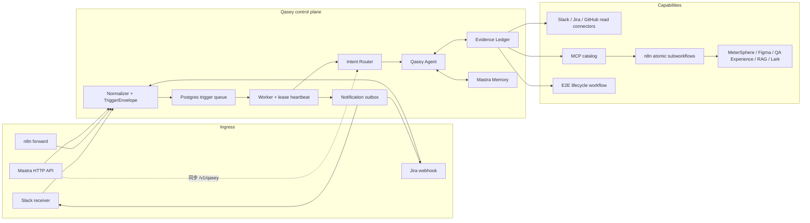
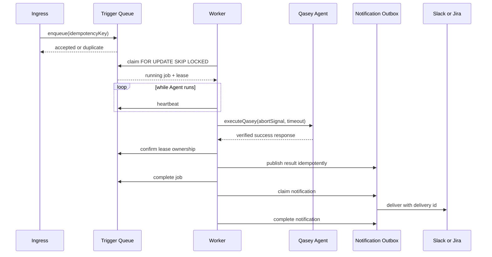
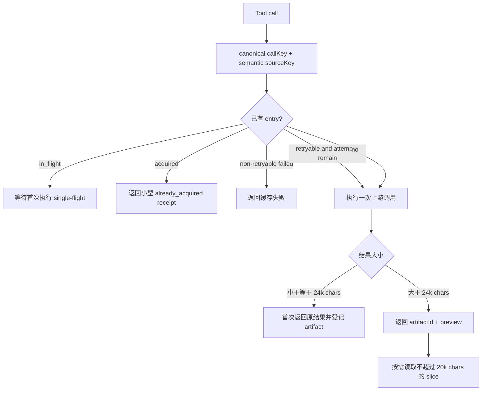
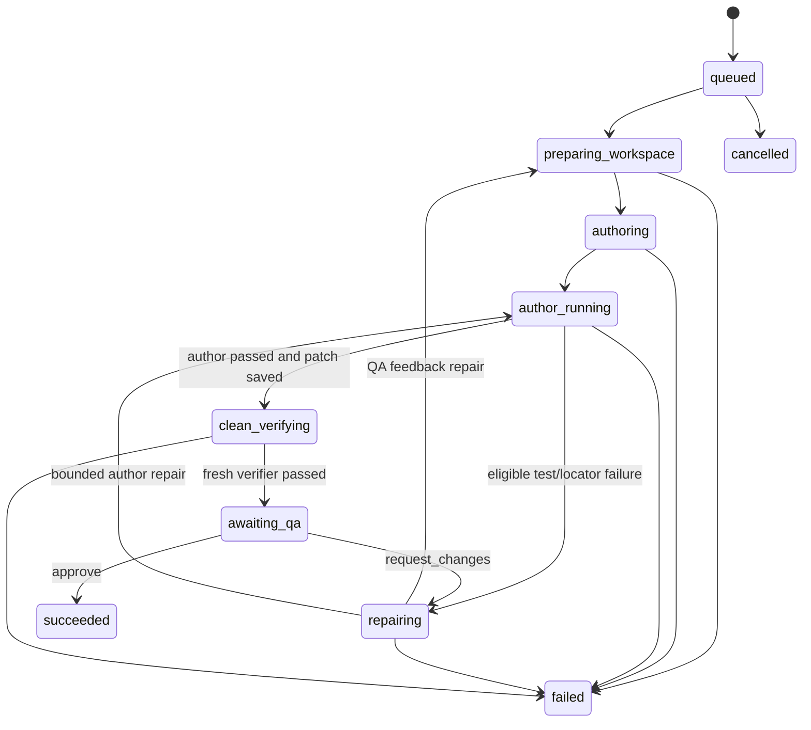

# Qasey

Qasey 是 MoeGo 的 QA Agent 服务，也是现有 n8n `Qasey v6` 的 TypeScript/Mastra 代码化迁移。它把 Slack、Jira 和 HTTP 请求统一成可追踪的 QA 会话，读取需求、设计、代码和历史经验，生成或维护 MeterSphere 测试用例，并提供 Playwright/Maestro E2E 的生成、验证和人工验收闭环。

本仓库负责“入口、编排、策略、状态和完成判定”；n8n 继续承载部分第三方 API 的原子 MCP 子流程。生产执行链路不依赖 LangSmith：代码没有 LangSmith SDK、trace exporter 或运行时配置依赖，Agent/Workflow 使用 Mastra 原生存储与 Observability，可选通过 Datadog Agent 上报 APM/LLM traces。

## 项目边界

Qasey 当前包含：

- Slack `app_mention` / DM、Jira comment webhook、同步 API、统一异步 trigger 和迁移期 n8n forward 入口。
- `TriggerEnvelope`、Postgres durable queue、lease/heartbeat、三次任务尝试和 notification outbox。
- LLM + deterministic fallback 的 intent routing，以及按渠道、意图和副作用过滤工具的 Qasey Agent。
- run 级 Evidence Ledger：single-flight、同源复用、大结果 artifact 化、错误分类、无进展熔断和运行统计。
- Mastra Working Memory + Observational Memory，Postgres thread/resource 会话持久化。
- MeterSphere、Figma、QA Experience、MoeGo RAG、Lark MCP catalog；Slack、GitHub、Jira 原生只读 connector。
- MeterSphere 批量写入、写后 fresh read 和完成凭证，防止“工具调过了但任务未完成”的假成功。
- 隔离 workspace 中的 E2E author、有限 repair、全新 checkout verifier、Draft PR 和 QA verdict workflow。
- Google OAuth、Mastra Studio/Editor、结构化日志、Mastra Observability、可选 Datadog Bridge、Docker 与 Helm。

以下内容仍属于环境或平台边界，不由仓库自动推断或托管：实际仓库和测试租户、Slack/Jira/MCP/GitHub 凭据、n8n workflow 的部署与 credential、Android/iOS runner pool，以及生产级对象存储和远程 Job dispatcher。

## 总体架构



Qasey 不是把整个业务继续塞进一个 Agent loop。稳定的接收、排队、租约、投递、E2E lifecycle 和成功判定由确定性代码负责；Agent 只负责 intent 下的资料选择、分析和结果综合。

## Ingress、队列与通知生命周期

### Slack

`apps/api/src/slack-receiver.ts` 使用 Slack Bolt：

- 接受 channel 中的 `app_mention` 和人类发出的 DM；忽略 bot、自身消息和无关 channel message。
- 去掉 mention，保留 thread identity，并把 Slack 文件转成 attachment reference。
- 使用 Slack `event_id` 形成 request/event id 和幂等键，写入 durable trigger queue 后立即 ACK。
- 本地可用 Socket Mode；生产默认使用签名校验的 HTTP Events API `/slack/events`。

Slack receiver 与 worker 是独立进程，因此两者启用时必须配置同一个 `DATABASE_URL`。非 shadow 请求会在原 thread 创建一条可更新的进度消息；最终回复不由 Agent 直接发送，而由 outbox 投递。

### HTTP API 与 n8n forward

- `POST /v1/qasey` 是登录保护的同步调试/兼容接口：通过 event inbox 去重后直接运行 intent router 和 Agent。
- `POST /v1/triggers` 接受完整 `TriggerEnvelope + QaseyRequestContext`，用 `QASEY_INGRESS_TOKEN` Bearer 鉴权，入队后返回 `202`。
- `POST /webhooks/n8n` 是迁移期 forward 入口，用 `x-qasey-webhook-token` 鉴权，规范化后进入同一队列。

### Jira

`POST /webhooks/jira` 校验 webhook token，只处理 comment 中明确提及 Qasey account 或 `@Qasey` 的事件，并忽略 Qasey 自己写回的 `🤖 Qasey` comment。issue key 是 session identity 的一部分，最终结果由 outbox 写回同一个 issue。

### Trigger queue、worker 与 outbox



Postgres queue 使用 `idempotency_key UNIQUE`、`FOR UPDATE SKIP LOCKED` 和可回收 lease。worker 默认每 15 秒 heartbeat，lease 为 90 秒；失去 lease 或连续三次 heartbeat 失败会中止 Agent，防止旧 worker 提交结果。Agent 总执行上限默认 10 分钟。

任务失败后最多执行三次，默认 30 秒后重新入队；第三次失败才进入 `failed` 并排队一条用户可见 error notification。通知与 Agent 任务分开重试：notification 最多五次，通知失败不会重跑已成功的 Agent。result/error 各自使用稳定的 outbox 幂等键，Slack 还把 delivery id 作为 `client_msg_id`。

Trigger queue 是 at-least-once：进程在外部写成功、job 完成前崩溃时，lease 到期后会产生新的 Agent run。outbox 幂等键能阻止重复最终通知，但 run 级 Evidence Ledger 不跨 attempt 持久化，不能单独保证外部 mutation 的 exactly-once；写工具仍应在 n8n/目标系统边界使用稳定业务幂等键或可验证 upsert。MeterSphere update 有明确 case id 和 fresh read 证明，create 的跨进程 exactly-once 仍取决于该下游幂等约束。

`QASEY_SHADOW_MODE=true` 时 Agent、memory 和只读证据链仍正常运行，但不会开放持久化写工具、E2E mutation 或发送 Slack/Jira 最终通知；worker 会记录截断后的 `shadow_result`。

## Intent routing 与 Qasey Agent

Intent Router 先用一个最多一步、结构化输出的轻量 Agent 生成 `IntentRoute v2`：

- QA：`qa_quick_query`、`qa_review`、`case_create_full`、`case_maintain_fast`、`experience_read/write`。
- E2E：`e2e_generate`、`e2e_rerun`、`e2e_repair`、`e2e_status`。
- 路由还包含 `relation`、`writeTarget`、`depth`、confidence 和 fallback 状态。

没有模型凭据或 Router 调用失败时，系统使用 deterministic classifier；如果 abort signal 已触发则不会吞掉取消/超时。无法安全判断写意图时路由保持只读。

Qasey Agent 根据 route 动态构造 prompt 和 tools：

- `ToolPolicy` 同时检查渠道、intent、副作用类型和人工审批；delete 永不提供给 Agent。
- shadow mode 会把带写目标的 route 降级为只读 `qa_review` 工具集。
- Studio 缺少真实 ingress context 时只允许 development 的只读预览；test/production fail closed。
- 可选 Code Mode 用于多工具分页、过滤和聚合，但审批工具仍暴露在 Mastra 层，避免绕过 suspension。
- 每次 generate 最多 80 steps、工具并发 6；真正的退出条件还包括 Evidence Ledger 无进展熔断和严格完成校验。

Agent 的最终结果只有满足以下条件才会返回 `outcome: success`：finish reason 是正常 `stop`、没有未完成 tool call，并且最后一步存在独立最终答案。case create/maintain 还必须持有 MeterSphere 完成凭证，否则抛出 `INCOMPLETE_OUTCOME`，由 queue 按失败语义处理。

## Evidence Ledger：去重、artifact 与完成判定

每次 `executeQasey` 都创建一个独立的 run 级 `EvidenceLedger`。它当前是进程内状态，生命周期等于本次 Agent run；不是跨 job/进程的永久缓存。所有原生 connector、远程 MCP 和 E2E tools 都在执行边界被 Ledger 包装。



### 调用身份与 single-flight

- `callKey` 由 tool name 和稳定排序后的 canonical arguments 计算；Figma `1-2` / `1:2` node id 会归一化。
- `sourceKey` 表示 Slack thread、GitHub PR metadata/diff、Figma node 等业务来源，可复用参数形式不同但覆盖等价的读取。Slack thread 只有已获取的 `limit` 大于等于新请求时才能复用，较小快照不会冒充更完整结果。
- 并发重复调用等待首次执行，串行重复调用直接返回 `artifactId/contentHash/preview` receipt，不再次请求上游，也不会把完整大结果反复塞回模型上下文。

### Artifact 与上下文控制

Ledger 会为每个成功结果计算 SHA-256 content hash 并存储序列化 artifact。超过 24,000 字符的首次结果只返回最多 4,000 字符 preview；Agent 如确实缺少细节，只能通过 `qasey_read_evidence_artifact` 按 offset 读取，单片硬上限 20,000 字符。每轮注入的 manifest 是本 run 已获取/失败来源的权威清单，因此即使 Observational Memory 压缩了旧 tool result，Agent 也无需重新抓来源。

### 错误和重试

- HTTP 408、425、429、5xx 及 timeout/network 类错误标记为 retryable，Ledger 最多允许两次总尝试，即一次后续重试。
- 其他 4xx（包括 401/403）和普通执行错误为 non-retryable；相同调用再次出现时返回缓存失败，不请求上游。
- 第一次真实失败会正常抛出，让 Mastra 看见 tool error；之后的禁重/缓存结果是结构化 receipt。

### 无进展熔断与统计

新增来源、状态变化或首次读取某个 artifact slice 才算进展；Code Mode 的 `executeTypescript` 外壳本身不算外部证据。一次有工具调用但无新增证据会警告 Agent 改为综合或明确 blocker；连续两次则停止循环。没有工具调用的文本轮不会误触发此熔断。

成功的 worker 日志包含：

- `actualToolExecutions`
- `deduplicatedToolCalls`
- `cachedToolFailures`
- `artifactReads`
- `artifactizedResults`
- `duplicateResultCharsAvoided`

对应的完整统计也随同步 `executeQasey` 结果返回。

## Mastra Memory

配置 `DATABASE_URL` 后，Qasey 使用 Mastra Postgres storage，以 `sessionId` 为 thread、actor id 为 resource 保存会话；没有数据库的本地单进程调试不会启用 Agent memory。

Memory 由三层组成：

- Working Memory：当前 QA 目标、范围、证据链接、约束、覆盖、E2E 环境、进度和验收状态。
- Observational Memory Observer：原始历史约 30k tokens 时，把较旧消息和工具结果压缩为 observations，同时维护 Working Memory。
- Reflector：observations 约 40k tokens 时再次压缩；需要精确措辞时可在当前 thread recall 原始消息。

主 Agent 与 memory model 都通过 OpenAI-compatible Responses API 并设置 `store: false`；默认 memory model 是 `gpt-5.4-mini`。120k `TokenLimiter` 是最终输入保护，且配置校验要求硬上限大于两个 OM threshold 之和。Observer/Reflector 会输出 `memory.observation.*` 和 `memory.reflection.*` 日志。

Evidence Ledger 和 Memory 解决不同问题：Memory 负责跨轮/跨请求的语义连续性；Ledger 负责一次 run 内的工具执行事实、artifact 定位和确定性去重。

## MCP catalog 与 n8n 子流程边界

Qasey 使用官方 `MCPClient` 从 `.qasey/mcp.json` 发现远程工具。当前 catalog 支持 `metersphere`、`figma`、`qaExperience`、`rag` 和 `lark`，每个 server 可独立选择 `none`、Bearer 或 OAuth 2.1 + PKCE。`listToolsWithErrors()` 会隔离 server discovery 故障，一个 MCP 不可用不会吞掉其余工具。

发现到的工具还要经过固定 allowlist 和 route/channel policy：

- MeterSphere 读工具可用于 QA 查询/评审/用例意图；create/edit/upsert 只对 case create/maintain 开放。
- QA Experience upsert 只对 Slack 的 `experience_write` 开放，并要求 Mastra approval。
- Figma、RAG、Lark 只作为外部读取能力。
- MCP server 发来的 instructions 不会转发到 Agent，防止远端替换系统行为。

n8n 的职责是“原子 adapter”：接收已经验证的工具参数，调用第三方 API，做响应裁剪和必要的 pre/post-condition 校验，再返回结构化结果。Qasey 负责跨工具 intent、Evidence Ledger、重试策略、阶段控制、写入完成判定和通知；这些状态不放到 n8n 子流程里。仓库中的 `n8n/n8n-workflows/` 和部署/patch 脚本是子流程定义与运维资产，不是生产 Agent 主循环。

### Figma 参数校验与 403 语义

Figma tool 在请求 n8n/上游前执行本地参数校验。`file_key` 必须是从 Figma `/design/<file_key>/` URL 中提取的非空 key：

- node id（如 `4366:10167`）误传到 `file_key` 时返回 `INVALID_ARGUMENT`/400，应放入 `node_ids`。
- 页面标题或名称（含空白）误传到 `file_key` 时本地拒绝。
- 完整 Figma URL 不作为 `file_key` 接受，必须先拆出 file key 和独立 node id。

因此这三类参数错误不会再请求上游，也不应被伪装成权限 403。真实的 401/403 由 Evidence Ledger 标记为 non-retryable；429、5xx 和网络错误才有一次后续重试机会。

### MeterSphere 写入与完成凭证

优先使用 n8n 的 `ms_bulk_upsert_test_cases`：单批最多 25 个 create/update，严格校验字段、module id/path 一致性和 leaf module，`dry_run` 只做预检，mutation payload 强制空 deletion ids。该子流程在写入后逐条 GET 并核对目标字段，不匹配会抛出 `postcondition_error`。

Qasey 侧还做第二层完成约束：

1. 记录最近一次成功的 MeterSphere write。
2. 每次成功 mutation 推进 `mutationEpoch`，使之前缓存的 MeterSphere list/get 失效；相同参数的写后查询必须实际重新读取。
3. verification 的 `startedSequence` 必须严格大于 write 的 `completedSequence`；写前查询和与写并发启动的查询都不能充当读回证明。
4. 只有后续成功的 `ms_list_test_cases` 或 `ms_get_test_case_detail` 才组成 completion receipt。
5. receipt 出现后运行时关闭 active tools，让 Agent 只做最终综合；case create/maintain 没有 receipt 必须失败，不能返回“已完成”。

这套约束把“第三方 API 返回 success”“n8n 字段 postcondition 通过”和“Agent run 确实完成写后 fresh read”分成三层验证。

## E2E lifecycle workflow

E2E 由注册在 Mastra 的确定性 workflow 管理，不依赖 Agent 自己记住下一步：



执行细节：

- Web 只允许 Playwright，App 只允许 Maestro。
- Author 从固定 `baseRef` shallow clone 到隔离 workspace，读取仓库 skills，用 ACP coding harness 仅修改 `allowedPaths`。
- 每次运行先校验 changed paths；assertion failure 不允许用 repair 弱化断言。普通测试实现失败最多按 `QASEY_MAX_REPAIRS` 修复，Cua 只在后期 locator 探索条件下作为可选 observation，不能判定 pass/fail。
- Author 通过后保存 binary patch 和运行 artifacts，销毁 workspace。
- Verifier 重新 clone 干净仓库，只 apply 已保存 patch，再安装依赖并运行相同 runner；不会调用 coding harness。
- clean verifier 通过后可创建 Draft PR，然后 workflow suspend 在 `awaiting_qa`。QA approve 时将 PR 转 Ready 并标记 `succeeded`；request changes 会重新 author、clean verify 并再次 suspend。
- rerun 创建全新 run，不覆盖旧 evidence；cancel 和状态转换都受显式 state machine 约束。

Playwright/Maestro 产生 report、log、trace、video、screenshot 等 artifact；本地 artifact store 会复制文件、计算 SHA-256，并通过受路径检查的 `/v1/runs/:runId/artifacts/:artifactId` 提供读取。生产执行容器模板不挂 Docker socket，不自动挂 ServiceAccount token，启用 non-root、seccomp、只读 root filesystem 和 capabilities drop。

## Storage 与 observability

| 数据/能力 | 本地默认 | 生产约束 |
| --- | --- | --- |
| Trigger queue、outbox、event inbox、E2E run/event | 未配数据库时进程内；Slack/worker 不允许这样运行 | `DATABASE_URL` Postgres |
| Mastra thread/resource memory 与 workflow snapshot | 配置 `DATABASE_URL` 后使用主 PostgresStore | 必须配置 `DATABASE_URL` |
| MCP OAuth token | `.qasey/oauth/`，文件权限 `0600` | Postgres + `MASTRA_ENCRYPTION_KEY`，AES-256-GCM |
| Editor domain | `.qasey/mastra-editor` filesystem | 启用 Editor 时必须独立 `EDITOR_DATABASE_URL` |
| Observability domain | `.qasey/observability.duckdb` | 必须独立 `OBSERVABILITY_DATABASE_URL` |
| E2E artifacts | `.qasey/artifacts` | Helm RWX PVC；规模化后应换 S3-compatible store |
| E2E workspace | `.qasey/workspaces` | 当前 Helm `emptyDir`；规模化后换 Job dispatcher |

Mastra `Observability + MastraStorageExporter` 始终保留 Studio 可读的 traces、metrics 和 logs。生产可设置 `QASEY_ENABLE_DATADOG=true` 启用官方 `DatadogBridge`；`dd-trace` 在进程最早期初始化，使 Agent、模型、tool、HTTP 和 Postgres span 能落到同一 APM trace。默认不采集 prompt/tool input/model output，只有完成数据分类、权限和 retention 评审后才应打开 `QASEY_DATADOG_CAPTURE_CONTENT`。

结构化日志包含 `eventId/jobId/runId`、阶段和 duration；启用 Datadog 时注入 trace/span id。生产观测主链是 Mastra storage + 可选 Datadog Agent，明确不依赖 LangSmith。

## 目录结构

```text
apps/
  api/                 Slack Bolt receiver
  worker/              trigger consumer + Agent runner + notification dispatcher
  cli/                 MCP OAuth login CLI
packages/
  contracts/           Trigger、request、intent、test case、E2E schema
  domain/              normalizer、router、policy、queue、run repository、Evidence Ledger
  adapters/            config、MCP、Slack/Jira/GitHub、attachments、OAuth storage、logging
  e2e/                 coordinator、workspace、ACP harness、runner、artifact、Cua、Job manifest
src/mastra/
  index.ts              Mastra/Auth/Observability 组装
  runtime.ts            storage、catalog、tools 和运行依赖
  service.ts            单次 Qasey 执行、Ledger hooks、完成判定
  intent-agent.ts       intent router
  qasey-agent.ts        主 Agent 与 Memory
  e2e-workflow.ts       durable E2E lifecycle
  routes.ts             HTTP/webhook/run API
n8n/
  n8n-workflows/        Figma、MeterSphere、QA Memory、Lark 原子子流程
  scripts/              workflow 构建、patch、probe 和 live/test 工具
deploy/
  postgres/             queue/outbox/OAuth 初始化 SQL
  slack/                Slack app manifest
tests/                  domain、adapter、Mastra service/runtime 与真实 Playwright smoke tests
```

## 本地开发

要求 Node.js 24、pnpm 11、PostgreSQL；E2E smoke 还需要 Chromium。

```bash
cp .env.example .env
docker compose up -d postgres
pnpm install
pnpm exec playwright install chromium
```

分别启动控制 API、Slack receiver 和 worker：

```bash
pnpm dev
pnpm dev:slack
pnpm dev:worker
```

所有进程自动读取仓库根目录 `.env`。`pnpm dev` 会 watch；Slack receiver 和 worker 不是 watch 模式，代码变化后需要重启。Studio 默认位于 `http://localhost:4111`。

最小配置按能力递增：

- 仅同步 API/Agent：`OPENAI_API_KEY`；使用兼容网关时再配置 `OPENAI_BASE_URL`。不配 `DATABASE_URL` 时适合单进程短时调试，但没有持久化 Agent memory。
- Slack：`SLACK_BOT_TOKEN`，本地 Socket Mode 再配 `SLACK_SOCKET_MODE_APP_TOKEN`；生产 HTTP 模式配 `SLACK_SIGNING_SECRET`。receiver/worker 必须共享 `DATABASE_URL`。
- Slack 搜索：额外 `SLACK_USER_TOKEN` 和 `search:read`。
- Jira：`JIRA_BASE_URL`、`JIRA_EMAIL`、`JIRA_API_TOKEN`、`JIRA_WEBHOOK_TOKEN`。
- E2E author：`QASEY_ENABLE_EXECUTION=true` 和可用的 `QASEY_ACP_COMMAND`；Draft PR 还需 `QASEY_ENABLE_DRAFT_PR=true`、`GITHUB_TOKEN` 且关闭 shadow mode。
- MCP：复制 catalog 后只保留已启用 server；缺少配置的 server 不参与发现，也不影响启动。

### MCP 配置与 OAuth

```bash
mkdir -p .qasey
cp config/mcp.example.json .qasey/mcp.json
# 删除未启用 server，替换 endpoint，并把 token 只放入对应环境变量
pnpm mcp:login -- <server-name>   # 仅 OAuth server 需要
```

n8n MCP 动态注册需要把 `http://127.0.0.1:31300/oauth/callback` 到 `http://127.0.0.1:31310/oauth/callback` 共 11 个精确地址加入 callback allowlist；`mcp:login` 会在端口冲突时使用 fallback。Bearer server 不需要登录。

生产镜像只包含空 MCP catalog；环境对应的 `mcp.json` 由部署仓库中的 ConfigMap 挂载，Bearer/OAuth secret 继续由 Secret 注入。

### Google OAuth 与 Studio

生产的 `/v1/qasey`、E2E run/artifact/verdict 和 Mastra 内建 API 默认要求登录；`/healthz`、`/readyz` 以及自行校验 token/signature 的 webhook/trigger 保持公开。Google OAuth callback：

```text
https://<QASEY_PUBLIC_BASE_URL-host>/api/auth/sso/callback
```

生产至少需要 `GOOGLE_CLIENT_ID`、`GOOGLE_CLIENT_SECRET`、不少于 32 字符的 `GOOGLE_COOKIE_PASSWORD`、`MASTRA_LICENSE_KEY` 和 `DATABASE_URL`。建议用 `GOOGLE_ALLOWED_DOMAINS` 校验已验证的 Workspace `hd` claim；`GOOGLE_HOSTED_DOMAIN` 只是登录提示。浏览器 SSO 缺少 Mastra license 时生产 fail closed。

公开入口只暴露 `/slack/events`、`/healthz`、`/readyz`、`/api/auth`、`/v1`、`/webhooks` 和 `/runs`，不暴露 Studio 根路径或 Mastra `/api`。如需生产 Studio，应在部署仓库中增加独立的内部路由、Google OAuth，并按需叠加公司 oauth2-proxy。

## 主要接口

- `GET /healthz`、`GET /readyz`：进程健康与 storage readiness。
- `POST /v1/qasey`：同步 Qasey 调试/兼容接口。
- `POST /v1/triggers`：统一异步入口。
- `POST /webhooks/n8n`：迁移期 n8n forward。
- `POST /webhooks/jira`：Jira comment webhook。
- `POST /v1/runs`：创建 E2E run。
- `GET /v1/runs/:runId`、`GET /events`、`GET /artifacts`：读取 run、timeline 和证据。
- `POST /v1/runs/:runId/rerun`、`/cancel`、`/qa-verdict`：控制 lifecycle。
- `GET /runs/:runId`：QA review 页面。

Web E2E 的最小请求：

```json
{
  "sourceSessionId": "slack-thread-C01-100.1",
  "sourceCaseIds": ["MS-CASE-1"],
  "platform": "web",
  "framework": "playwright",
  "repository": {
    "owner": "MoeGolibrary",
    "repository": "target-web",
    "cloneUrl": "https://github.com/MoeGolibrary/target-web.git",
    "baseRef": "main",
    "allowedPaths": ["e2e", "playwright.config.ts"],
    "skillsPaths": [".agents/skills", ".claude/skills"],
    "installCommand": ["pnpm", "install", "--frozen-lockfile"]
  }
}
```

App 请求使用 `platform: "app"`、`framework: "maestro"`，并把 `allowedPaths` 指向 `.maestro`。真实设备执行应调度到 Android/KVM 或 macOS runner pool。

## 日志、测试与构建

典型 worker 日志顺序：

```text
slack.event.received
worker.trigger.claimed
worker.agent.phase
worker.agent.tool.started / completed
worker.agent.iteration.completed
worker.trigger.heartbeat
worker.trigger.completed
worker.notification.sent
```

重点失败事件：

- `slack.event.enqueue_failed`：receiver 无法写 durable queue。
- `worker.trigger.timed_out`：超过 Agent deadline，本 attempt 失败并按 queue 规则重试。
- `worker.trigger.lease_lost` / `heartbeat_failed`：worker 不再拥有任务，不允许提交结果。
- `worker.agent.tool.failed`：真实工具执行失败；结合 `toolDisposition` 区分 executed/deduplicated/cached_failure。
- `worker.trigger.failed`：包含 `eventId/jobId`，模型网关错误还会附带 upstream request id。
- `worker.notification.failed`：业务执行已成功，仅投递失败。
- `mcp.tools.discovery_failed`：单个 MCP server 发现失败，其他 server 仍可用。

完整检查：

```bash
pnpm typecheck
pnpm test
pnpm build
# 或一次执行全部
pnpm check
```

Vitest 覆盖 normalizer、queue、policy、MCP config/Figma validation、Evidence Ledger、service 完成语义、runtime guard 和 E2E coordinator/workspace/job manifest。`pnpm demo:web` 会运行真实 Chromium Playwright smoke，并验证 report、trace、screenshot 和 log evidence。

镜像构建：

```bash
docker build --target api -t qasey:local .
docker build --target worker -t qasey-worker:local .
```

Kubernetes/ArgoCD 资源统一维护在 [`MoeGolibrary/moego-k8s-apps` 的 `apps/moego-qasey`](https://github.com/MoeGolibrary/moego-k8s-apps/tree/main/apps/moego-qasey)，不在本仓库维护第二份 chart。部署为独立 `api`、`slack`、`worker` Deployment。Secret 至少承载业务/认证数据库和凭据；MCP catalog 放 ConfigMap；artifact PVC 需要 RWX storage class。开发阶段部署到 `moego-server-cluster-development/ns-devops`，正式发布部署到 `moego-server-cluster-devops/ns-devops`。默认 `shadowMode=true`、`executionEnabled=false`、`draftPrEnabled=false`，应在 shadow 结果和写后验证确认后再逐项开启。

迁移期 n8n baseline 见 [`n8n/fixtures/qasey-live-v6.manifest.json`](n8n/fixtures/qasey-live-v6.manifest.json)，分阶段切流与待办见 [`PLAN.md`](PLAN.md)。
