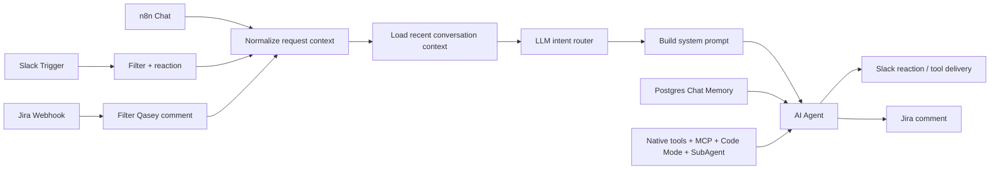
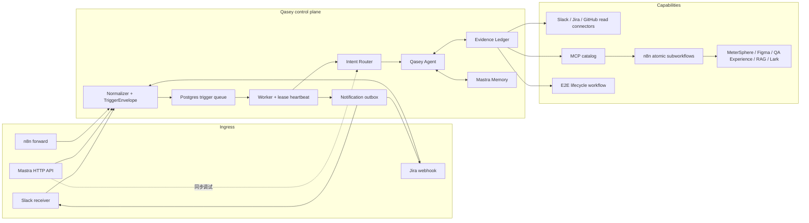

# Qasey：代码版与 n8n 版架构对比

> 历史说明：本文记录旧 n8n 迁移方案。当前运行时、入口和部署约定以 [`ARCHITECTURE.md`](../ARCHITECTURE.md) 与 [`production-runbook.md`](production-runbook.md) 为准；旧 queue/outbox/worker 已删除。
>
> 状态：迁移决策参考  
> 对比日期：2026-08-17  
> n8n baseline：[Qasey workflow](https://n8n.devops.moego.pet/workflow/Vw8YbsOWTmqlNR3o)（workflow ID `Vw8YbsOWTmqlNR3o`，active version `98062ed9-03b4-450b-a4e9-5978ff60b61b`）

## 1. 结论

n8n 版是一个以 Agent 为中心的可视化单体工作流：入口、上下文标准化、意图识别、工具编排、渠道反馈和错误路径集中在一次 n8n execution 中。代码版则把系统改造成以确定性控制面为中心的混合架构：入口、持久队列、Worker、策略、完成判定、通知和 E2E lifecycle 由 TypeScript/Mastra 控制，n8n 仅继续承载部分第三方 API 的原子 MCP 子流程。

代码版的主要收益不是“代码比节点更高级”，而是把以下生产语义从 prompt 和 Agent 自觉中移到了可测试的代码边界：

- 哪些请求允许写入，哪些工具可以被 Agent 看见；
- 任务、外部写入和用户通知分别在什么条件下算成功；
- Worker 崩溃、超时、重复事件和通知失败时如何恢复；
- 大结果、重复工具调用和无进展循环如何受控；
- E2E 代码生成、执行、独立验证和人工验收如何形成状态机。

因此，代码版更适合作为长期目标架构；n8n 版仍适合作为当前 production baseline、回滚路径和原子 adapter 平台。迁移阶段应保持混合架构并通过 shadow 流量逐步切换，不应一次性下线 n8n。

## 2. 对比范围与事实快照

本次对比基于 2026-08-17 读取到的 active n8n workflow JSON，以及当前工作区代码。未修改或执行生产工作流。

n8n baseline 当前包含：

- 63 个节点；
- 3 个入口：n8n Chat、Slack Trigger、Jira Webhook；
- 1 个主 Agent、1 个只读调查 SubAgent；
- 32 个 Agent tool/tool wrapper；
- 5 个普通 Code 节点；
- Postgres Chat Memory；
- 45 分钟 workflow execution timeout；
- 主 Agent 最多 80 iterations，Code Mode 最大并发 6。

代码版当前验证结果：

- TypeScript typecheck 通过；
- 16 个 Vitest 文件、56 个测试全部通过；
- 测试覆盖 normalizer、queue、tool policy、MCP config、Evidence Ledger、完成语义、runtime guard 和 E2E coordinator 等核心边界；
- 这些结果只证明代码级行为，不等价于 production 流量、外部系统或 runner pool 已完成验证。

## 3. 总体架构

### 3.1 n8n 版

所有入口最终汇合到同一个 Agent loop。工具集合大部分通过 Code Mode 统一暴露，intent 和写入协议主要由结构化路由结果与动态 system prompt 约束。渠道反馈与 Agent execution 同处一个 workflow，业务执行和通知交付没有独立持久化生命周期。

### 3.2 代码版

稳定且可以确定性表达的职责不再交给 Agent：接收、去重、排队、租约、重试、工具授权、完成判定、通知交付和 E2E 状态迁移均由代码控制。Agent 只负责 intent 范围内的资料选择、分析、工具参数生成和最终综合。

## 4. 关键差异

| 维度 | n8n 版 | 代码版 |
| --- | --- | --- |
| 系统形态 | 63 节点的可视化单体 workflow | API、Receiver、Worker、domain、adapter、E2E workflow 分层 |
| 执行生命周期 | 一次 n8n execution 内同步完成 | 持久队列异步执行，支持 lease、heartbeat、超时和 worker 扩容 |
| 幂等与恢复 | 依赖 trigger 行为、n8n execution 和下游接口 | `TriggerEnvelope.idempotencyKey`、Postgres queue、任务重试和 notification outbox |
| 工具授权 | 工具大多持续暴露，依赖 prompt 告诉 Agent 何时只读 | 按 channel、intent、effect 动态裁剪；delete 永不暴露；审批工具保留在 Mastra 层 |
| 意图提示词 | 在主 Agent prompt 中按 intent 描述工作方式和写后回查要求 | Prompt v8 按 12 类 intent 注入“目标、执行协议、完成条件、输出合同”，并叠加 depth、relation 和 channel 模块；不注入日期等易变值，保持缓存稳定 |
| 完成判定 | Agent 输出和 prompt 约定为主 | Controller 校验 finish reason、未完成 tool call、最终答案及 MeterSphere completion receipt |
| 证据管理 | 工具结果直接进入上下文，重复调用主要靠 Agent 避免 | run 级 single-flight、source 复用、artifact 化、错误缓存和无进展熔断 |
| Memory | Postgres Chat Memory，加最近 6 条消息用于路由 | Working Memory + Observational Memory + Reflector；Memory 与 Evidence Ledger 分工 |
| 通知交付 | Slack/Jira 节点属于主 execution | 任务结果先写 Outbox，再独立重试通知；通知失败不重跑成功的 Agent |
| E2E | 无完整 lifecycle | Author、bounded repair、clean verifier、Draft PR、QA verdict 状态机 |
| 可观测性 | n8n execution、节点数据和 tracing metadata | run/job/event ID、工具 disposition、阶段日志、Mastra Observability 和可选 Datadog APM |
| 变更方式 | UI 修改和 credential 绑定速度快 | Code Review、typecheck、单测、构建和部署 |

## 5. 代码版优势

### 5.1 成功语义更可信

case create/maintain 只有在 MeterSphere 写入成功，并且之后发生一次新的 list/get 回查时才能获得 completion receipt。写前查询和与写操作并发启动的查询都不能作为证明。没有 receipt 时，Controller 抛出 `INCOMPLETE_OUTCOME`，任务进入失败和重试语义，而不是接受 Agent 的“已完成”文本。

这把三件不同的事情明确分开：

1. 第三方 API 返回成功；
2. n8n 原子子流程的字段 post-condition 通过；
3. 整个 Agent run 确实完成了写后 fresh read。

### 5.2 副作用边界更强

代码版先用固定 allowlist 拒绝未登记工具，再按 route 和 channel 过滤：

- MeterSphere create/edit/upsert 只对 case create/maintain 开放；
- QA Experience upsert 只对 Slack `experience_write` 开放，并要求 Mastra approval；
- delete 工具永不提供给 Agent；
- shadow mode 把带写目标的 route 降级为只读工具集；
- 缺少真实 ingress context 时，test/production fail closed。

这些约束在执行边界生效，不依赖模型遵守 system prompt。

### 5.3 长任务恢复和通知更可靠

Postgres trigger queue 使用唯一幂等键、`FOR UPDATE SKIP LOCKED` 和可回收 lease。Worker 定期 heartbeat；失去 lease或连续 heartbeat 失败时会中止旧 Agent，避免旧 Worker 提交结果。

任务和通知分开重试：任务最多三次，通知最多五次。Agent 已成功但 Slack/Jira 暂时不可用时，只重试通知，不重新执行昂贵且可能有副作用的 Agent run。

### 5.4 工具调用和上下文成本可控

Evidence Ledger 为同一 run 提供：

- 相同调用的 single-flight；
- 同一业务来源的语义复用；
- retryable 与 non-retryable 错误分类；
- 大于 24,000 字符的结果 artifact 化；
- 按 offset 有界读取 artifact；
- 连续两次工具 iteration 没有新增证据时停止 Agent loop。

因此重复抓取不会反复请求上游，也不会把同一份大结果不断塞回模型上下文。

### 5.5 更适合 E2E 平台化

E2E 使用确定性 workflow，而不是要求 Agent 记住流程：

1. 创建隔离 Author workspace；
2. Coding Harness 仅修改允许路径；
3. 执行测试并进行有限 repair；
4. 保存 patch 和 artifacts；
5. 在全新 checkout 中 apply patch 并独立验证；
6. clean verifier 通过后创建 Draft PR；
7. suspend 等待 QA approve 或 request changes。

Runner 的退出码和断言决定通过与否，模型和 Cua 都不能自行声明测试通过。

### 5.6 意图不再只是路由标签

Prompt v8 为 12 类意图分别定义了目标、执行协议、完成条件和输出合同，包括 QA 快问/评审、用例新建/维护、经验读写及 E2E generate/rerun/repair/status。`depth` 会实际控制 quick、standard、deep 的取证范围，`relation` 会控制新任务与追问如何继承历史；两者不再只是运行时上下文字段。

这补齐了旧代码版相对 n8n 的明显不足：过去虽然会把 intent、depth 和 relation 写入系统提示词，但 intent 只有一句宽泛策略，depth/relation 没有对应行为模块。现在 Agent 的软行为约束已经按意图细化；写权限、审批、完成判定仍由代码控制面硬约束，避免把安全性重新寄托在 prompt 上。

## 6. 代码版不足与未解决问题

### 6.1 运维复杂度提高

代码版需要同时维护 API、Slack Receiver、Worker、Postgres、Mastra storage、observability storage、MCP OAuth storage、artifact storage 和 E2E runner。相比一个 n8n 平台，部署、容量规划、告警和故障排查的责任明显增加。

### 6.2 仍然依赖 n8n

MeterSphere、Figma、QA Experience 和 Lark 等能力仍有部分由 n8n 原子子流程承载。代码版目前不是完全去 n8n；n8n、MCP endpoint 或其中的 credential 故障仍会影响对应能力。

### 6.3 外部 mutation 不是完整 exactly-once

Trigger queue 是 at-least-once。如果下游 create 已成功，但 Worker 在完成 job 前崩溃，lease 到期后可能产生新的 Agent attempt。Outbox 能阻止重复最终通知，Evidence Ledger 只能在单个 run 内去重，不能跨进程 attempt 保证 mutation exactly-once。

MeterSphere update 有稳定 case ID 和 fresh read 证明；create 仍需要下游支持稳定业务幂等键、可验证 upsert 或补偿策略。

### 6.4 生产 E2E 基础设施尚未闭环

当前 artifact 主要依赖本地目录或 RWX PVC，规模化后需要 S3-compatible storage；workspace 当前可使用 `emptyDir`，规模化后需要远程 Job dispatcher。Android/iOS runner pool、真实测试租户和目标仓库配置也属于环境边界。

### 6.5 生产证明弱于 active n8n baseline

代码版 typecheck 和单元/集成测试通过，但默认仍是 `shadowMode=true`、`executionEnabled=false`、`draftPrEnabled=false`。在没有完成真实流量 shadow 对比、负载测试、故障演练和外部系统验证前，不能仅凭代码结构宣布迁移完成。

### 6.6 迭代门槛更高

n8n 可以直接在 UI 查看节点数据、修改表达式、切换 credential 和重新执行。代码版的行为变更通常需要开发、Review、CI、镜像构建和部署；这提高了安全性和可审计性，也降低了非开发人员自主修改流程的速度。

### 6.7 Prompt v8 仍需要真实任务评测

针对 12 类意图的契约测试只能证明对应模块被正确组装，不能证明模型在所有真实输入上都会选到最优证据、稳定遵循输出合同或优于 n8n。上线前仍应使用同一批代表性请求做 shadow 对比，分别评估路由准确率、无效工具调用、证据质量、任务完成率、token 和耗时，并把失败样本固化为回归集。

## 7. n8n 版优势

- 已经是 active production baseline，具备真实渠道、credential 和运行历史；
- UI 对 QA、运营和开发都直观，单次 execution 的节点输入输出容易检查；
- Slack、Jira、GitHub、Postgres 和 AI 节点已有 credential 管理和常用操作封装；
- 修改 prompt、工具描述、路由和渠道格式的交付速度快；
- 基础部署和平台维护职责集中，不需要单独运行多种 Qasey 进程；
- n8n Chat 可直接用于交互调试，Agent、memory 和 tool wiring 一目了然。

## 8. n8n 版风险与审阅发现

以下发现基于 workflow JSON。若 API Gateway、Ingress 或 MCP server 内部还有未体现在 workflow 中的保护，需要把相应结论降级，并把外部保护写入系统文档。

### 8.1 必须修复

#### Jira Webhook 未配置认证

`Jira Trigger` 是公开 POST Webhook，workflow 参数中没有 authentication。当前只在后续 IF 节点检查 comment 是否包含 Qasey account mention，并排除 `🤖 Qasey` 自身回复；mention 过滤不是调用方认证。

如果 Ingress 层没有独立的签名或 token 校验，知道 URL 的调用方可以触发 workflow、消耗模型和工具资源。应在 Webhook 或受信入口增加 Header/JWT/Basic auth，并保留 self-loop filter。

#### 删除工具暴露给 Code Mode

MeterSphere MCP 的 `includeTools` 当前包含 `ms_delete_modules`。`Code-Mode-Tool.excludeSiblingTools` 只根据 Slack/Jira 渠道排除发送工具，没有根据 intent 或 effect 排除 MeterSphere write/delete 和 QA Experience write。

因此在 read-only intent 中，删除和写工具仍可能被 Code Mode 发现并调用；当前安全性主要依赖 system prompt。应至少：

1. 从主 workflow 的 include list 移除 `ms_delete_modules`；
2. 按 intent 动态裁剪 write tools，而不是只写 prompt；
3. 对审批写工具使用 Agent 可见的 HITL/approval 边界，不要隐藏在通用 Code Mode 中。

### 8.2 应当修复

#### 网络节点重试覆盖不足

按类型统计，workflow 中有 37 个 Slack、Jira、GitHub、Postgres、MCP 或 OpenAI 类可失败节点，只有 5 个显式配置 `retryOnFail`。大量工具请求没有独立的瞬时错误重试、退避或分类策略。

#### 业务成功与 execution success 混在一起

最近读取的 50 条 execution 都是 `success`，但最近多条 Webhook execution 在约 40–70ms 内结束，属于被过滤的事件，而不是完成了 Agent 任务。仅统计 n8n execution success 会高估用户任务成功率。

应增加 intent、是否进入 Agent、tool outcome、写入 receipt、渠道交付结果等业务维度。

#### 缺少确定性 completion receipt

n8n prompt 已明确要求 MeterSphere 写入后回查，这是正确方向；但 workflow 没有 Controller 在 Agent 结束后检查“成功 write + 更新后的 read-back”是否真实发生。模型提前结束时仍可能输出看似完成的文本。

#### 可维护性开始下降

workflow 已有 63 个节点但没有 node groups。`Search for messages in Slack` 和 `Get a user's profile in Slack` 节点当前未连接到 Code Mode/Agent；另有一个未连接的 sticky note。应确认两个工具是遗漏连接还是历史残留，并按入口、路由、Agent、工具、交付和错误处理分组。

## 9. 建议决策

采用代码版作为目标控制面，同时保留 n8n 的两类职责：

1. 迁移期 production baseline 和回滚入口；
2. 经验证、契约稳定、无跨工具业务状态的原子 adapter。

不建议继续把 durable queue、跨工具完成判定、E2E lifecycle 或副作用授权叠加到当前 n8n 主 workflow；这些能力应保留在代码控制面。

## 10. 分阶段迁移门槛

### 阶段一：先加固 n8n baseline

- 为 Jira Webhook 补齐真实认证；
- 移除 Agent 可见的 delete 工具；
- 对 write 工具增加 intent 级硬过滤；
- 修复或删除未连接工具；
- 补充业务级成功、失败和交付指标。

### 阶段二：代码版 shadow

- 同一请求同时进入 n8n production path 和代码版只读 shadow path；
- 对比 intent、工具集合、证据来源、最终结论、token/耗时和错误分类；
- 写意图在 shadow 中保持只读，不发送用户通知；
- 建立可接受差异和必须一致字段，不只比较最终自然语言。

### 阶段三：切换只读流量

- 先切 `qa_quick_query`、`qa_review` 和 `experience_read`；
- 验证 queue lease、MCP 隔离、memory continuity、通知 outbox 和渠道格式；
- 保留按 request 或 channel 回退 n8n 的开关。

### 阶段四：切换写流量

- MeterSphere create/update 使用稳定幂等策略；
- 用真实任务验证 write → fresh read completion receipt；
- 做 Worker crash、lease lost、上游 429/5xx、通知失败等故障演练；
- QA Experience approval 必须证明无法从 Code Mode 绕过。

### 阶段五：开启 E2E 与 Draft PR

- 接入生产对象存储和远程 runner/job dispatcher；
- 验证 clean-room verifier、allowed paths 和 artifact 完整性；
- 先开启 E2E execution，再独立开启 Draft PR；
- QA verdict 和 PR Ready 保持人工控制，禁止自动合并。

## 11. 参考实现

- 总体架构与迁移边界：[`README.md`](../README.md)
- 迁移计划：[`PLAN.md`](../PLAN.md)
- 原生 Workflow durability 与旧 queue 移除说明：[`workspace-and-durability.md`](workspace-and-durability.md)
- Tool policy：[`packages/domain/src/tool-policy.ts`](../packages/domain/src/tool-policy.ts)
- MCP allowlist 与 route/channel filtering：[`packages/adapters/src/mcp.ts`](../packages/adapters/src/mcp.ts)
- Evidence Ledger：[`packages/domain/src/evidence-ledger.ts`](../packages/domain/src/evidence-ledger.ts)
- Prompt v8 与意图合同：[`packages/domain/src/prompt.ts`](../packages/domain/src/prompt.ts)
- Prompt 组装测试：[`tests/domain/prompt.test.ts`](../tests/domain/prompt.test.ts)
- Agent 完成判定：[`src/mastra/service.ts`](../src/mastra/service.ts)
- E2E lifecycle：[`src/mastra/e2e-workflow.ts`](../src/mastra/e2e-workflow.ts)
- n8n baseline manifest：[`n8n/fixtures/qasey-live-v6.manifest.json`](../n8n/fixtures/qasey-live-v6.manifest.json)
